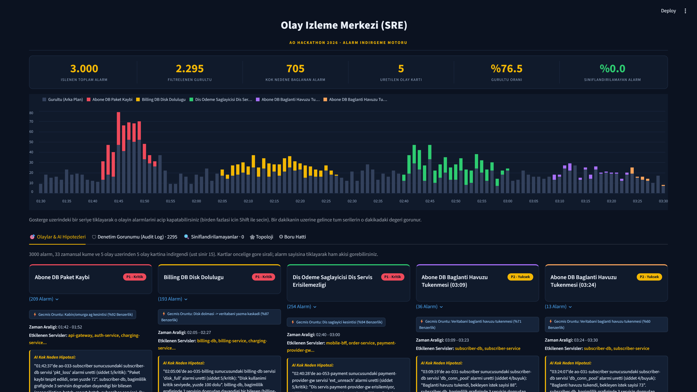
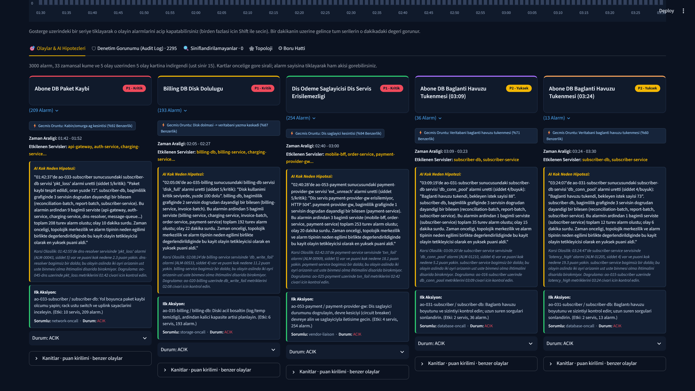
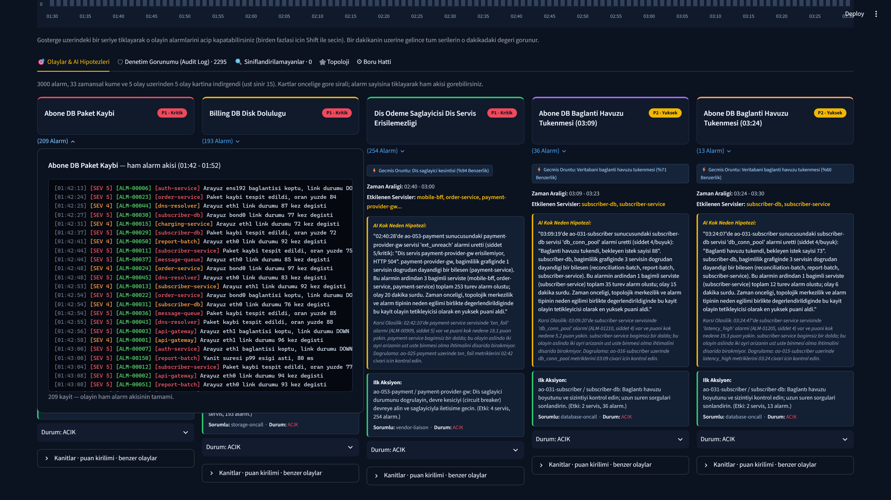
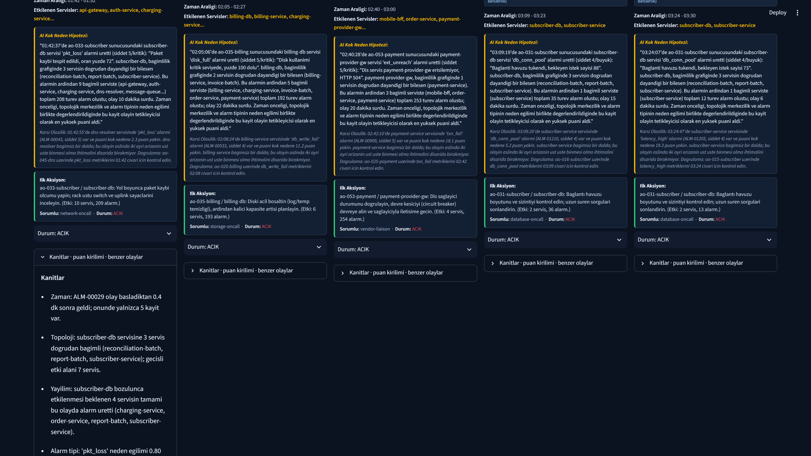
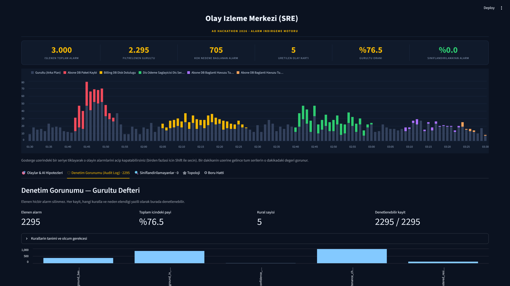
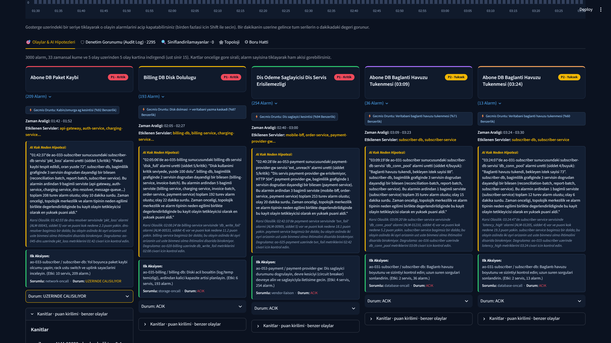
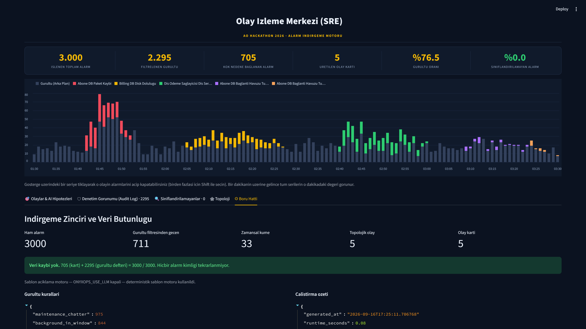

# OnyxOps — Olay Izleme Merkezi (SRE)

> **AO Hackathon 2026 · Senaryo S-A1 "Alarm Firtinasi"**
> 2 saatlik pencerede uretilmis **3.000 alarmi**, servis bagimlilik topolojisi
> ve zamansal analizle **5 olay kartina** indirger (ust sinir 15). Her kart kok
> neden hipotezini, kanitlarini, karsi olasiligini ve izlenebilir bir aksiyonu
> icerir. **Veri kaybi sifir, siniflandirilamayan alarm yok.**



---

## 1. Proje ne yapiyor?

Nobetci muhendisin gece 02:14'te karsilastigi asil problem alarm sayisi degil,
alarmlar arasindaki **neden-sonuc iliskisinin gorunmez olmasidir**. OnyxOps bu
seli okunabilir birkac karara indirger ve — daha onemlisi — **bu indirgemenin
gerekcesini gosterir**.

| Olcut | Deger |
|---|---|
| Islenen alarm | **3.000 / 3.000** — ornekleme yok |
| Filtrelenen gurultu | **2.295** (%76,5), tamami gerekceli |
| Kok nedene baglanan alarm | **705** |
| Uretilen olay karti | **5** (ust sinir 15) |
| Siniflandirilamayan alarm | **0** (%0) |
| Indirgeme orani | **600x** |
| Veri butunlugu | 705 + 2.295 = **3.000** ✔ |
| Calisma suresi | **~0,2 saniye** |

| Kart | Alarm | Servis | Kok neden hipotezi | Oncelik |
|---|---|---|---|---|
| INC-001 | 209 | 10 | `subscriber-db` / **pkt_loss** — dc1/rack-A ag kesintisi | P1 |
| INC-002 | 193 | 6 | `billing-db` / **disk_full** | P1 |
| INC-003 | 254 | 4 | `payment-provider-gw` / **ext_unreach** | P1 |
| INC-004 | 36 | 2 | `subscriber-db` / **db_conn_pool** (03:09) | P2 |
| INC-005 | 13 | 2 | `subscriber-db` / **db_conn_pool** (03:24) | P2 |

---

## 2. Kurulum

Python 3.11+ gerekir.

```bash
git clone https://github.com/MFrknK/ao-hackathon-2026-onyxops.git
cd ao-hackathon-2026-onyxops
python -m pip install -r requirements.txt
cp .env.example .env        # opsiyonel — LLM zenginlestirmesi icin
```

### `.env.example` icerigi

Uygulama **anahtarsiz da eksiksiz calisir**; `.env` yalnizca opsiyonel LLM
zenginlestirmesi ve yol/port ayarlari icindir.

| Degisken | Varsayilan | Ne ise yarar |
|---|---|---|
| `ANTHROPIC_API_KEY` | *(bos)* | Kok neden aciklamasinin dogal dille zenginlestirilmesi. Bos ise sablon motoru devreye girer. |
| `ANTHROPIC_MODEL` | `claude-sonnet-5` | Kullanilacak model. |
| `ONYXOPS_USE_LLM` | `false` | LLM zenginlestirmesini acar/kapatir. **Teslim ciktilari `false` ile uretildi.** |
| `ONYXOPS_DATA_DIR` | `./data` | Girdi CSV klasoru. |
| `ONYXOPS_OUTPUT_DIR` | `./output` | Uretilen JSON ciktilari. |
| `STREAMLIT_SERVER_PORT` | `8501` | Pano portu. |
| `STREAMLIT_SERVER_HEADLESS` | `true` | Tarayici otomatik acilmasin. |

## 3. Calistirma

```bash
python -m src.verify_setup     # Veri paketi + repo iskeleti dogrulamasi (23 kontrol)
python -m src.pipeline         # Korelasyon motoru -> output/*.json
streamlit run src/app.py       # Operator panosu -> http://localhost:8501
```

```
INDIRGEME : 3000 alarm -> 5 kart (600.0x)
BUTUNLUK  : 705 (kart) + 2295 (gurultu) = 3000 / 3000  OK
```

**Deploy URL:** Yok — uygulama yerel calisir. Kalici veritabani gerektirmez,
veri paketiyle sifirdan ayaga kalkar.

---

## 4. Nasil calisiyor?

```
data/  alarms.csv · service_dependencies.csv · host_inventory.csv
  ├─ Faz 1  Yukleme + envanter zenginlestirmesi + yonlu bagimlilik grafigi
  ├─ Faz 2  Gurultu filtresi -> cift duyarlikli artis dedektoru -> kumeleme
  ├─ Faz 3  Sure frenli union-find ile olay birlestirme -> 5 bilesenli kok neden
  ├─ Faz 4  JSON kart semasi + oncelik + kalite kapisi + 15 kart kapagi
  └─ Faz 5  Streamlit NOC panosu
```

### Dort kritik tasarim karari

**1. Sabit zaman penceresi yerine servis bazli taban orani.**
Her servis 2 saat boyunca kesintisiz alarm uretiyor (`mobile-bff` dakikada
~2,3). "Bosluk < 4 dk ise ayni kume" mantigi tum pencereyi tek kumeye
cokertir. Onun yerine her servisin **kendi taban orani** (dakika basi alarm
medyani) olculup artis pencereleri bulunuyor — iki duyarlikta: 3 dk/3x
(**burst**) ve 9 dk/1,8x (**slow-burn**).

**2. Alarm tipi onselleri sezgiyle degil olcumle belirlendi.**
Her tipin zaman eksenindeki standart sapmasi hesaplandi; 121 dakikalik
pencerede duzgun dagilimin beklenen degeri 34,9:

| Zamanda sikismis (olay imzasi) | Zamanda duzgun (arka plan) |
|---|---|
| `network_down` 0,8 · `pkt_loss` 0,8 · `ext_unreach` 0,9 · `disk_full` 1,5 | `network_flap` 32,9 · `latency_high` 33,7 · `mem_high` 35,9 · `cpu_high` 36,5 |

Ilk kalibrasyonda `network_flap` en buyuk olayin kok nedeni secilmisti; olcum
bunun arka plan oldugunu gosterdi ve duzeltildi.

**3. Birlestirme olcusu aralik ortusmesi degil, baslangic ani yakinligi.**
Bir arizanin imzasi, bagimli servislerin **birbiri ardina bozulmaya
baslamasidir**. Gecisli birlesmeye ayrica bir sure freni kondu.

**4. Kartin "N alarm" sayisi gercekten olaya ait.**
Artis penceresine denk gelmis dusuk siddetli arka plan olayin kendi kaydi
degildir; kumeye yalnizca siddet >= 4 alarmlar girer. Digerleri silinmez —
`background_in_window` gerekcesiyle Gurultu Defteri'ne yazilir.

Ayrintili anlatim: [docs/mimari.md](docs/mimari.md)

---

## 5. Ekran goruntuleri

### Ana pano — ozet serit ve zaman serisi


Ust seritte alti metrik; altinda dakika bazli **yigilmis zaman serisi**. Her
olay kendi renginde, arka plan gurultusu gri. Gostergedeki bir seriye
tiklayarak o olayin alarmlari acilip kapatilir; bir dakikanin uzerine gelince
tum serilerin o dakikadaki degeri tek kutuda gorunur.

### Olay kartlari — kok neden, kanit, karsi olasilik


Oncelik rozeti (P1/P2/P3), gecmis oruntu cipi, zaman araligi, etkilenen
servisler, **AI kok neden hipotezi**, **karsi olasilik**, ilk aksiyon +
sorumlu ve durum menusu.

### Ham alarm akisi — kartin arkasindaki kayitlar


Kart basligindaki **(209 Alarm)** dugmesine basildiginda o olaya ait ham alarm
akisi terminal gorunumunde acilir. Hicbir sey kara kutu degil.

### Kanitlar · puan kirilimi · benzer olaylar


### Denetim gorunumu (Audit Log)


Elenen 2.295 alarmin tamami, hangi kuralla ve **neden** elendigi yazili olarak
denetlenebilir. Hicbir alarm silinmez.

### Aksiyon takibi


`Acik -> Uzerinde calisiliyor -> Cozuldu` gecisleri zaman damgasiyla
`output/action_log.json` dosyasina yazilir; sayfa yenilense de korunur.

### Veri butunlugu


Tum goruntuler: [demo/](demo/) — `python -m src.capture_demo` ile tekrar
uretilebilir.

---

## 6. Kullanilan AI araclari

| Arac | Model / surum | Nerede kullanildi |
|---|---|---|
| **Claude Code** (CLI + VS Code eklentisi) | **Opus 5 (1M context)** | Projenin tamami: veri kesfi, algoritma tasarimi, parametre kalibrasyonu, kod yazimi, hata ayiklama, belgeleme |
| **Anthropic Messages API** | `claude-sonnet-5` | *Opsiyonel* — kok neden anlatiminin zenginlestirilmesi. **Varsayilan kapali**; teslim ciktilari deterministik sablon motoruyla uretildi |

**Kullanilmayanlar:** Cursor, GitHub Copilot veya baska bir AI kodlama araci
bu projede kullanilmamistir.

**AI yapilandirma dosyasi:** [CLAUDE.md](CLAUDE.md) — ajanin uymak zorunda
oldugu kurallar (veri kaybi yasagi, ornekleme yasagi, determinizm, LLM
opsiyonelligi, sir saklama).
**Prompt dosyasi:** [prompts/root_cause_explanation.md](prompts/root_cause_explanation.md)

### LLM'in **karar vermedigi** nokta
Kok neden ve karsi olasilik **her zaman** deterministik puanlama motorundan
cikar ([src/root_cause.py](src/root_cause.py)). LLM yalnizca anlatimi
zenginlestirir. Gerekce: korelasyon karari denetlenebilir olmak zorunda; bir
olasilik dagilimina birakilamaz.

## 7. MCP sunuculari

**Kullanilmamistir.** Tum veri yerel CSV dosyalarindan okunur; harici sistem
erisimi yoktur.

## 8. Entegre API'ler

| API | Zorunlu mu | Kullanim |
|---|---|---|
| Anthropic Messages API | Hayir | Kok neden aciklamasinin zenginlestirilmesi (`ONYXOPS_USE_LLM=true` ise) |

Baska hicbir dis API cagrisi yapilmaz; uygulama internet olmadan bastan sona
calisir.

---

## 9. Kullanilan kutuphaneler

| Kutuphane | Neden |
|---|---|
| `pandas` | CSV okuma ve pano tablolari |
| `streamlit` | Operator panosu |
| `altair` | Yigilmis zaman serisi (Streamlit ile gelir) |
| `anthropic` *(opsiyonel)* | LLM aciklama zenginlestirmesi |
| `playwright` *(yalnizca demo)* | Ekran goruntulerinin tekrar uretilebilir cekimi |
| standart kutuphane | `csv`, `json`, `datetime`, `dataclasses`, `collections`, `statistics`, `bisect`, `math` |

**Bilincli olarak kullanilmayanlar:** `networkx` (32 kenarlik grafik icin
gereksiz agirlik — [src/topology.py](src/topology.py) icinde dort islem
yeterli), `scikit-learn` (kumeleme alan mantigiyla yapiliyor, kara kutu ile
degil).

---

## 10. Ciktilar

| Dosya | Icerik |
|---|---|
| [output/incidents.json](output/incidents.json) | 5 olay karti + ozet + zaman serisi + butunluk kaniti |
| [output/noise_ledger.json](output/noise_ledger.json) | Elenen 2.295 alarm, kural ve gerekceyle |
| [output/action_log.json](output/action_log.json) | Aksiyon durum gecisleri |
| [output/topology.json](output/topology.json) | Bagimlilik grafigi ve merkezilik degerleri |
| [output/incident_history.json](output/incident_history.json) | Olay imza arsivi — calistirmalar arasi oruntu eslesmesi |

## 11. Belgeler

- [docs/plan.md](docs/plan.md) — faz faz calisma plani
- [docs/fazlar.md](docs/fazlar.md) — faz gunlugu
- [docs/mimari.md](docs/mimari.md) — mimari, algoritmalar, cikti sozlesmesi
- [AI_JURI.md](AI_JURI.md) — AI is akisi, X-Factor ve kanit dosya yollari

## 12. Determinizm

Rastgelelik yoktur; tum iterasyonlar siralidir. Ayni girdi her calistirmada
ayni 5 karti ayni sirayla uretir. Tek istisna kartlardaki `similar_incidents`
bolumudur: dogasi geregi gecmis calistirma arsivine baglidir.
