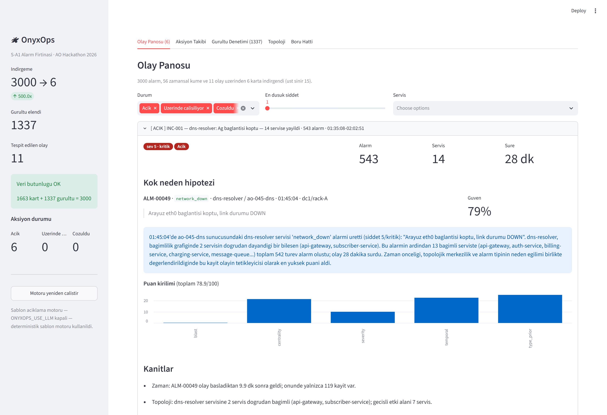
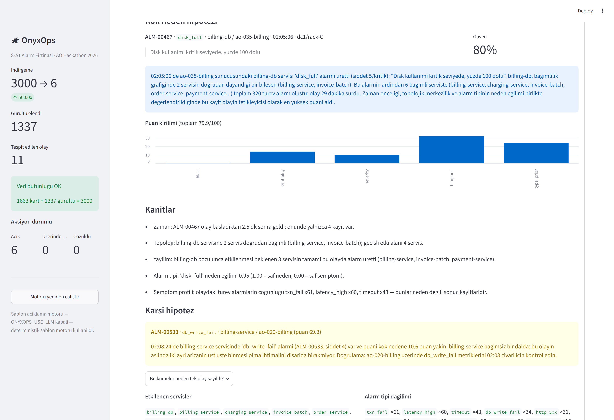
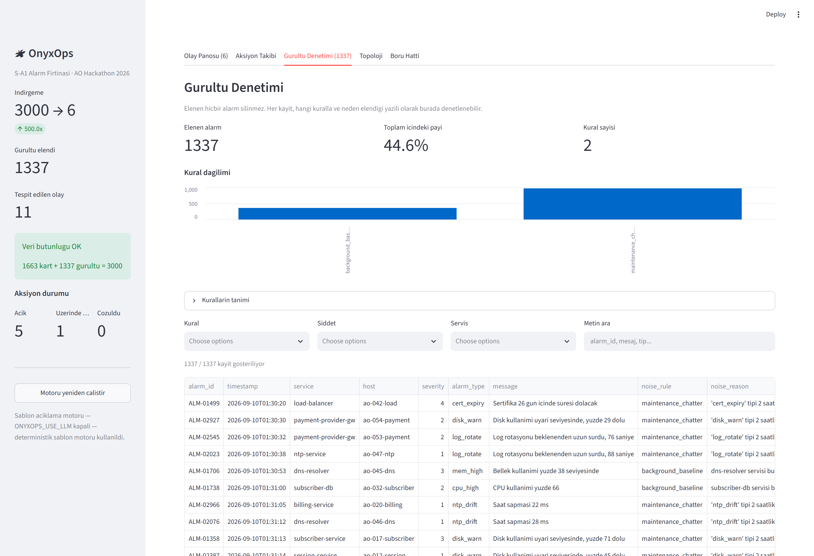
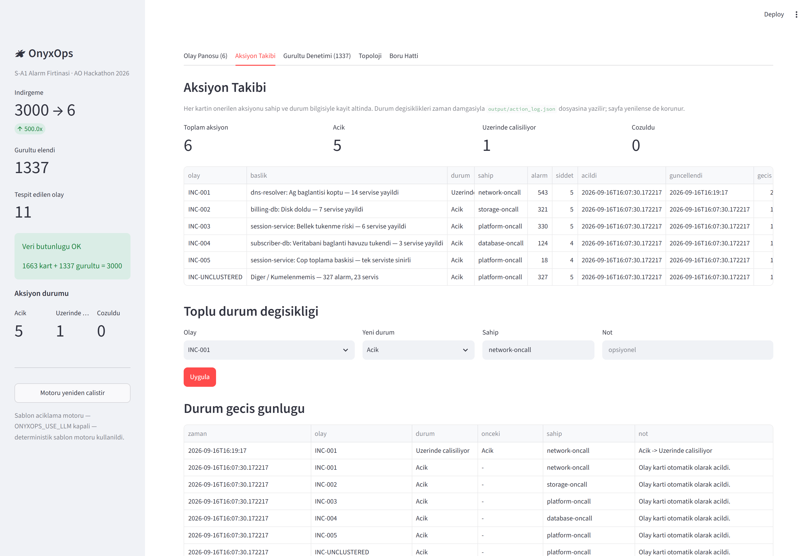

# OnyxOps — Alarm Firtinasi Korelasyon Motoru

> **AO Hackathon 2026 · Senaryo S-A1**
> 2 saatlik pencerede uretilmis **3.000 alarmi**, servis bagimlilik topolojisi ve
> zamansal analizle **6 olay kartina** indirger (ust sinir 15). Her kart kok
> neden hipotezini, kanitlarini, karsi hipotezini ve izlenebilir bir aksiyonu
> icerir. **Veri kaybi sifir.**



---

## Sonuclar

| Olcut | Deger |
|---|---|
| Islenen alarm | **3.000 / 3.000** — ornekleme yok |
| Uretilen kart | **6** (5 olay + 1 toplayici), ust sinir 15 |
| Indirgeme orani | **500x** |
| Elenen gurultu | **1.337** (%44.6) — tamami gerekceli, denetlenebilir |
| Veri butunlugu | 1663 (kart) + 1337 (gurultu) = **3.000** ✔ |
| Calisma suresi | **0.11 saniye** |

| Kart | Alarm | Servis | Kok neden hipotezi | Guven |
|---|---|---|---|---|
| INC-001 | 543 | 14 | `dns-resolver` / **network_down** — dc1/rack-A ag kesintisi | %79 |
| INC-002 | 321 | 7 | `billing-db` / **disk_full** | %80 |
| INC-003 | 330 | 6 | `session-service` / **oom_risk** — bellek sizintisi | %76 |
| INC-004 | 124 | 3 | `subscriber-db` / **db_conn_pool** | %73 |
| INC-005 | 18 | 1 | `session-service` / **gc_pressure** — sizintinin erken evresi | %76 |
| INC-UNCLUSTERED | 327 | 23 | Kalan olaylar + artik sinyal (veri kaybi yok) | — |

---

## Kurulum

Python 3.11+ gerekir.

```bash
python -m pip install -r requirements.txt
cp .env.example .env      # opsiyonel — LLM zenginlestirmesi icin
```

## Calistirma

```bash
python -m src.verify_setup     # Veri paketi + repo iskeleti dogrulamasi (23 kontrol)
python -m src.pipeline         # Korelasyon motoru -> output/*.json
streamlit run src/app.py       # Operator panosu -> http://localhost:8501
```

`python -m src.pipeline` ciktisi:

```
Faz 1  veri      : 3000 alarm, 56 host, 27 servis, 32 bagimlilik
Faz 2a gurultu   : 1337 elendi (44.6%), 1663 sinyal kaldi
Faz 2b kumeleme  : 56 kume {'burst': 25, 'slow_burn': 31}, 232 artik
Faz 3  olay      : 56 kume -> 11 olay (topolojik/mekansal birlestirme)
Faz 4  kart      : 6 kart (sinir 15)

INDIRGEME : 3000 alarm -> 6 kart (500.0x)
BUTUNLUK  : 1663 (kart) + 1337 (gurultu) = 3000 / 3000  OK
```

---

## Nasil calisiyor

```
data/  alarms.csv · service_dependencies.csv · host_inventory.csv
  |
  ├─ Faz 1  Yukleme + zenginlestirme + yonlu bagimlilik grafigi
  ├─ Faz 2  Gurultu filtresi (3 kural) -> cift duyarlikli artis dedektoru -> kumeleme
  ├─ Faz 3  Sure frenli union-find ile olay birlestirme -> 5 bilesenli kok neden puani
  ├─ Faz 4  JSON kart semasi + oncelik + kalite kapisi + 15 kart kapagi
  └─ Faz 5  Streamlit panosu (5 sekme)
```

### Uc kritik tasarim karari

**1. Sabit zaman penceresi yerine servis bazli taban orani.**
Bu veri setinde her servis 2 saat boyunca kesintisiz alarm uretiyor
(`mobile-bff` dakikada ~2.3). "Bosluk < 4 dk ise ayni kume" mantigi tum
pencereyi tek kumeye cokertir. Bunun yerine her servisin **kendi taban orani**
(dakika basi alarm medyani) olculup, o oranin uzerine cikan artis pencereleri
tespit ediliyor. Iki farkli duyarlikta: 3 dk/3x (**burst**) ve 9 dk/1.8x
(**slow-burn**). Yavas gelisen olaylar ikincisiyle yakalaniyor.

**2. Alarm tipi onselleri sezgiyle degil olcumle belirlendi.**
Her tipin zaman eksenindeki standart sapmasi hesaplandi. 121 dakikalik
pencerede duzgun dagilimin beklenen std degeri 34.9'dur:

| Zamanda sikismis (olay imzasi) | Zamanda duzgun (arka plan) |
|---|---|
| `network_down` 0.8 · `pkt_loss` 0.8 · `ext_unreach` 0.9 · `disk_full` 1.5 | `network_flap` 32.9 · `latency_high` 33.7 · `mem_high` 35.9 · `cpu_high` 36.5 |

Ilk kalibrasyonda `network_flap` yuksek onselle en buyuk olayin kok nedeni
secilmisti; olcum bunun arka plan oldugunu gosterdi ve duzeltildikten sonra
dogru cevap (`network_down`) cikti.

**3. Birlestirme olcusu aralik ortusmesi degil, baslangic ani yakinligi.**
Slow-burn kumeleri 20-40 dakikaya yayildigi icin "araliklari ortusuyor mu"
testi 56 kumeyi tek olaya cokertiyordu. Bir arizanin imzasi, bagimli
servislerin **birbiri ardina bozulmaya baslamasidir**. Ayrica gecisli
birlesmeye bir sure freni kondu (`INCIDENT_MAX_SPAN_MIN`).

Ayrintili anlatim: [docs/mimari.md](docs/mimari.md)

---

## Ekran goruntuleri

### Olay karti — kok neden, kanit, karsi hipotez


Her kartta 5 bilesenli puan kirilimi, veriden turetilmis kanit maddeleri ve
farkli bir servisten gelen **karsi hipotez** yer alir.

### Gurultu denetimi (X-Factor)


Elenen 1.337 alarmin tamami, hangi kuralla ve **neden** elendigi yazili olarak
denetlenebilir. Hicbir alarm silinmez.

### Aksiyon takibi


Her kartin aksiyonu sahip + durum ile kayitli. `Acik -> Uzerinde calisiliyor ->
Cozuldu` gecisleri zaman damgasiyla `output/action_log.json` dosyasina yazilir
ve sayfa yenilense de korunur.

### Veri butunlugu


Pipeline her calistirmada `kart alarmlari + gurultu defteri == 3000`
esitligini ve alarm kimliklerinin benzersizligini dogrular; tutmazsa cikis
kodu 1 verir.

Tum goruntuler: [demo/](demo/) — `python -m src.capture_demo` ile tekrar
uretilebilir.

---

## Ciktilar

| Dosya | Icerik |
|---|---|
| [output/incidents.json](output/incidents.json) | 6 olay karti + ozet + butunluk kaniti |
| [output/noise_ledger.json](output/noise_ledger.json) | Elenen 1.337 alarm, kural ve gerekceyle |
| [output/action_log.json](output/action_log.json) | Aksiyon durum gecisleri |
| [output/topology.json](output/topology.json) | Bagimlilik grafigi ve merkezilik degerleri |

---

## Kullanilan AI araclari ve MCP

| Arac | Model | Kullanim |
|---|---|---|
| **Claude Code** | Opus 5 (1M context) | Tum gelistirme, veri kesfi, kalibrasyon, hata ayiklama |
| **Anthropic API** | `claude-sonnet-5` | *Opsiyonel* — kok neden anlatiminin zenginlestirilmesi. Varsayilan **kapali**; teslim ciktilari deterministik sablon motoruyla uretildi. |

**MCP sunucusu kullanilmamistir.** Tum veri yerel CSV dosyalarindan okunur.

AI yapilandirma dosyasi: [CLAUDE.md](CLAUDE.md)
AI is akisi ve kanitlar: [AI_JURI.md](AI_JURI.md)

---

## Kullanilan kutuphaneler

| Kutuphane | Neden |
|---|---|
| `pandas` | CSV okuma ve pano tablolari |
| `streamlit` | Operator panosu |
| `anthropic` *(opsiyonel)* | LLM aciklama zenginlestirmesi |
| `playwright` *(yalnizca demo)* | Ekran goruntulerinin tekrar uretilebilir cekimi |
| standart kutuphane | `csv`, `json`, `datetime`, `dataclasses`, `collections`, `statistics`, `bisect` |

**Bilincli olarak kullanilmayanlar:** `networkx` (32 kenarlik grafik icin
gereksiz agirlik — [src/topology.py](src/topology.py) icinde 4 islem yeterli),
`scikit-learn` (kumeleme alan mantigiyla yapiliyor, kara kutu ile degil).

---

## Belgeler

- [docs/plan.md](docs/plan.md) — faz faz calisma plani
- [docs/fazlar.md](docs/fazlar.md) — faz gunlugu, her fazda ne yapildigi ve nasil dogrulandigi
- [docs/mimari.md](docs/mimari.md) — mimari, algoritmalar, cikti sozlesmesi
- [AI_JURI.md](AI_JURI.md) — AI is akisi, X-Factor ve kanit dosya yollari
- [prompts/root_cause_explanation.md](prompts/root_cause_explanation.md) — LLM prompt'u

## Determinizm

Boru hattinda rastgelelik yoktur; tum sozluk/kume iterasyonlari siralidir.
Ayni girdi her calistirmada ayni 6 karti ayni sirayla uretir.
